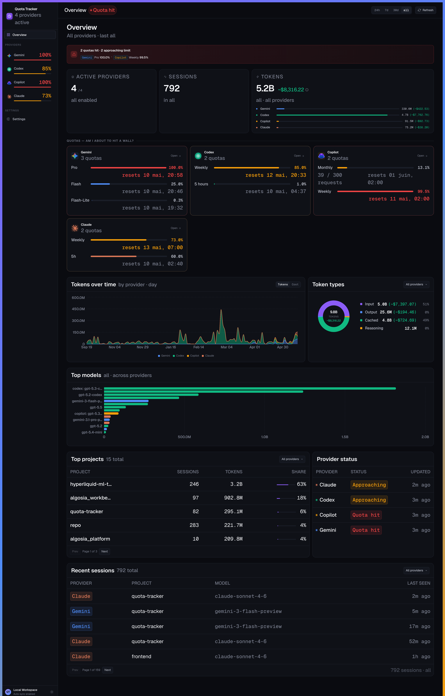

# quota-tracker

Track token usage and quotas for [Claude](https://claude.ai), [Copilot](https://github.com/features/copilot), [Codex](https://openai.com/codex) and [Gemini](https://gemini.google.com) — locally, with no telemetry.

[](https://github.com/Thomas97460/quota-tracker/actions/workflows/ci.yml)
[](https://github.com/Thomas97460/quota-tracker/actions/workflows/release.yml)
[](https://github.com/Thomas97460/quota-tracker/releases/latest)
[](https://github.com/Thomas97460/quota-tracker/actions/workflows/ci.yml)
[](https://github.com/Thomas97460/quota-tracker/actions/workflows/ci.yml)
[](https://github.com/Thomas97460/quota-tracker/actions/workflows/ci.yml)
[](https://github.com/Thomas97460/quota-tracker/actions/workflows/ci.yml)
[](https://www.python.org/)

<div align="center">

</div>

## Quick start

**Linux**

```bash
curl -fsSL https://raw.githubusercontent.com/Thomas97460/quota-tracker/main/install.sh | bash
```

Installs the binary, runs migrations, backfills history and starts a systemd user service. Open the printed URL when done.

**macOS**

```bash
git clone https://github.com/Thomas97460/quota-tracker
cd quota-tracker
uv sync
task run-api
```

Then open [http://localhost:8787](http://localhost:8787).
